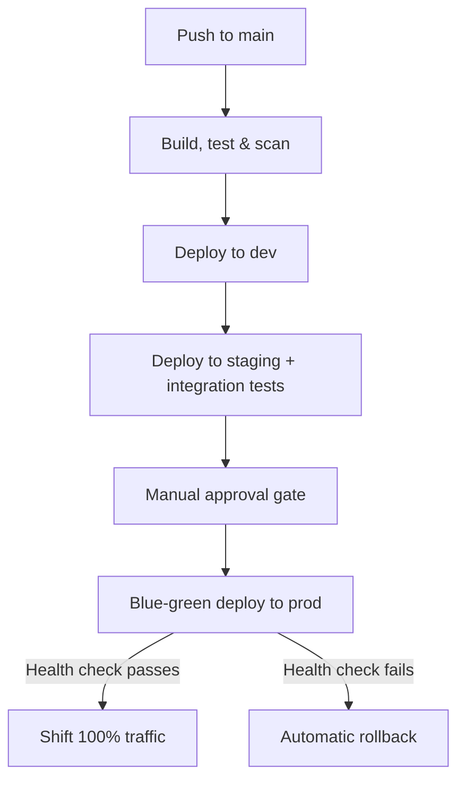

# Zero-downtime CI/CD pipeline for AWS ECS (blue-green + auto-rollback)

A complete CI/CD pipeline for a containerized application on AWS, built with
GitHub Actions and Terraform. Pushes to `main` flow through automated build,
test, and vulnerability scanning, deploy automatically to dev and staging,
wait for a manual approval gate, then deploy to production using a
blue-green strategy that rolls back automatically if the new version fails
its health checks.

## Architecture



All AWS infrastructure — VPC, ECS Fargate cluster, ALBs, ECR, IAM, CodeDeploy
— is provisioned with Terraform, so the entire environment is reproducible
from code.

**Services used:** GitHub Actions, AWS ECS Fargate, Amazon ECR, Application
Load Balancer, AWS CodeDeploy, CloudWatch, IAM (OIDC federation), Terraform,
Trivy.

## What this demonstrates

- **Multi-environment promotion** — dev and staging deploy automatically;
  production requires a human approval via a protected GitHub Environment.
- **Zero-downtime deployments** — production traffic shifts from the old
  (blue) task set to the new (green) one via CodeDeploy, with the old set
  kept alive for a few minutes in case a rollback is needed.
- **Automated rollback** — a CloudWatch alarm watches the green target
  group's 5xx rate during the shift; if it fires, CodeDeploy stops the
  deployment and reverts traffic to blue automatically, with no one paged
  at 2am to do it manually.
- **Security scanning as a gate, not an afterthought** — Trivy scans the
  built image for critical/high CVEs and fails the pipeline before
  anything reaches AWS.
- **Keyless CI authentication** — GitHub Actions assumes an AWS IAM role via
  OIDC federation. No long-lived AWS access keys live in repo secrets.
- **Infrastructure as code** — every AWS resource is defined in Terraform;
  there's no manual console clicking to recreate the environment.
- **Linting & quality gates** — automated Python style/format checking using Ruff, and HCL validation using Terraform validation in CI/CD before any build is triggered.
- **Workflow caching** — automatic caching of Python dependencies to speed up pipeline execution.

## Repository structure

```
app/                          Sample Flask service the pipeline builds & deploys
  app.py
  requirements.txt
  Dockerfile
  tests/
    test_app.py                Unit tests (run in CI)
    integration_test.py        Smoke tests run against staging post-deploy

.github/workflows/
  pipeline.yml                 The full pipeline: test -> build/scan/push ->
                                deploy dev -> deploy staging -> approval -> prod

appspec.yaml                   CodeDeploy AppSpec for the blue-green ECS deployment

terraform/
  providers.tf, variables.tf, outputs.tf
  network.tf                   VPC, subnets, NAT gateway
  security_groups.tf
  ecr.tf
  alb.tf                       Production ALB + blue/green target groups
  ecs.tf                       ECS cluster + production service (CodeDeploy-controlled)
  ecs_nonprod.tf                Dev/staging ALBs, target groups, and services
  codedeploy.tf                 CodeDeploy app + blue-green deployment group
  cloudwatch.tf                 Alarm that triggers automatic rollback
  iam.tf                        ECS roles, CodeDeploy role, GitHub OIDC role
  terraform.tfvars.example
```

## Prerequisites

- An AWS account and the AWS CLI configured locally (for the initial
  `terraform apply` — the pipeline itself authenticates via OIDC afterward).
- Terraform >= 1.6.
- A GitHub repository to push this code to.
- An S3 bucket for Terraform remote state (or remove the `backend "s3" {}`
  block in `providers.tf` to use local state for a quick demo).

## Setup

1. **Provision the infrastructure**

   ```bash
   cd terraform
   cp terraform.tfvars.example terraform.tfvars   # fill in github_org_repo
   terraform init -backend-config="bucket=<your-state-bucket>" \
                   -backend-config="key=cicd-demo/terraform.tfstate" \
                   -backend-config="region=us-east-1"
   terraform plan
   terraform apply
   ```

2. **Push an initial image manually** (the ECS task definitions reference
   `:latest`, which needs to exist before the first `terraform apply`'s
   services can start — or run the pipeline once against a repo with no
   running services and let it create the first revision).

   ```bash
   aws ecr get-login-password --region us-east-1 | \
     docker login --username AWS --password-stdin <account-id>.dkr.ecr.us-east-1.amazonaws.com
   docker build -t <ecr-repo-url>:latest app/
   docker push <ecr-repo-url>:latest
   ```

3. **Configure GitHub repo settings**

   - **Secrets** (Settings → Secrets and variables → Actions):
     - `AWS_GITHUB_OIDC_ROLE_ARN` — from the `github_deploy_role_arn` output
     - `STAGING_ALB_DNS` — from the `staging_alb_dns_name` output
   - **Environments** (Settings → Environments): create `dev`, `staging`,
     and `production`. On `production`, enable **required reviewers** —
     this is what implements the manual approval gate in the pipeline.

4. **Push to `main`** and watch the pipeline run end to end in the Actions
   tab.

## Notes & caveats

The Python app and its unit/integration tests are verified working in this
repo. The Terraform and the AWS-specific GitHub Actions steps were written
carefully and checked for valid HCL/YAML syntax, but couldn't be applied
against a live AWS account in the environment this was built in — run
`terraform validate` and `terraform plan` yourself before applying, and
expect to tweak resource names or IAM permissions slightly for your account.
AWS will bill for the NAT gateway, ALBs, and Fargate tasks while this is
running — run `terraform destroy` when you're done experimenting.

## Possible extensions

- Swap blue-green for a **canary** rollout using weighted ALB target groups.
- Add **Infracost** to the Terraform plan step to surface cost deltas on PRs.
- Add a **DAST scan** (e.g. OWASP ZAP) against staging before the approval
  gate, alongside the existing Trivy image scan.

## Resume bullet points

- Designed and built a CI/CD pipeline (GitHub Actions) for a containerized
  app on AWS ECS Fargate, automating build, test, vulnerability scanning,
  and promotion across dev, staging, and production environments.
- Implemented zero-downtime blue-green deployments to production with AWS
  CodeDeploy, including CloudWatch-alarm-triggered automatic rollback on
  failed health checks.
- Provisioned all AWS infrastructure (VPC, ECS, ALB, IAM, CodeDeploy) as
  code with Terraform, enabling a fully reproducible environment.
- Configured keyless AWS authentication for CI using OIDC federation,
  removing long-lived IAM credentials from the repository entirely.
